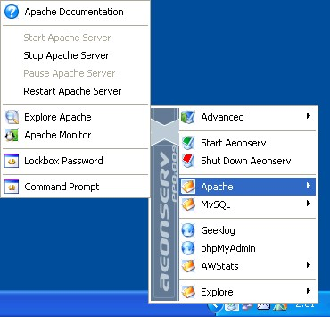
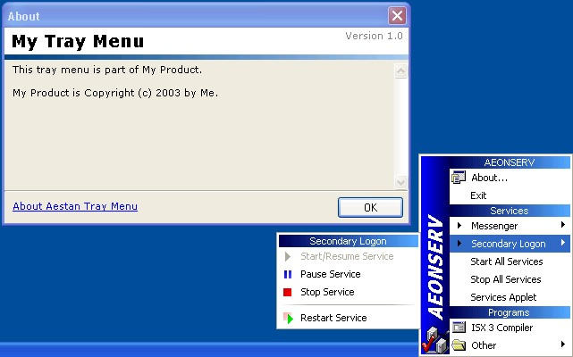

# Aestan Tray Menu

[AeTrayMenu](https://obroekma.home.xs4all.nl/aetraymenu/) is a small application that you can use to insert a flexible and configurable menu into your Windows system tray, which can be used to control services, run programs etc.

 
This work is dedicated to the [Public Domain](http://creativecommons.org/licenses/publicdomain/).

Yours sincerely, 
\- [Onno Broekmans](http://www.onnodb.com/)

## What is it?

When a friend requested me to write an imitation of the [Apache](http://www.apache.org/) Service Monitor, I decided I wanted to write something that would be generally useful and flexible. With Aestan Tray Menu, you can create your own tray menu with access to all sorts of applications, documents and services. AeTrayMenu is open-source.

### What does it do?

AeTrayMenu puts a tray icon in your system tray. When you click on it with your left or right mouse button, a popup menu will appear. The menus that appear are fully configurable.

### Features

An overview of the most important features of AeTrayMenu:

* Fully configurable;
* Separate menus for left and right click;
* Run programs and launch documents;
* Support for submenus;
* Service control options:
  * Start, stop, pause and resume services;
  * Separate tray icons and tray icon hints for service states;
  * Easy access to "Services" control panel applet
* Special menu design with sidebar and more;
* Execute multiple commands for one menu item;
* Handling of multiple instances.

### Screenshots

> Aeonserv Controller - A screenshot of AeTrayMenu as it's used in the Aeonserv package.

> Another screenshot showing an alternate layout of the traymenu, and the customizable about box.

## Who's using it?

* [Aeonserv](http://aeonserv.sourceforge.net/) – An installer for Apache, PHP and more, also including the webportal package External link (opens in a new window)Geeklog.
* [WAMP5](http://www.wampserver.com/) – Another excellent installer for Apache, PHP and more.
* [Neard](http://neard.io) - Portable WAMP software stack.

## Downloads

[Download](https://github.com/crazy-max/aetraymenu/releases/download/1.6.2/aetraymenu.zip) (ZIP; 1058 kB) – Archive including both the version of AeTrayMenu compiled with MadExcept (for non-commercial use only) and the version without MadExcept (for commercial use).